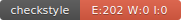

# Informations
**Etudiant** LAMAH Michel Marie

**Master** IA

**Groupe** IA/ILSEN Classique

# CircleCI

**SVG Style** 

**Shield style**  

# CodeCOV

# CheckStyle

# Rapports

Pour avoir plus d'informations sur les modifications effectuées dans chaque
TP, merci de bien vouloir jeter un coup d'oeil aux rapports ci-dessous.

- <a href="./TPs/T01_LAMAH.pdf" target="_blank" title="Voir le rapport du TP 1">TP 1</a>
- <a href="./TPs/TP02_LAMAH.pdf" target="_blank" title="Voir le rapport du TP 2">TP 2</a>
- <a href="./TPs/TP03_LAMAH.pdf" target="_blank" title="Voir le rapport du TP 3">TP 3</a>
- <a href="./TPs/TP04_LAMAH.pdf" target="_blank" title="Voir le rapport du TP 4">TP 4</a>
- <a href="." target="_blank" title="Voir le rapport du TP 5">TP 5</a>
- <a href="." target="_blank" title="Voir le rapport du TP 6">TP 6</a>
  
# JavaDoc

<a href="https://MichelMarieLamah13.github.io/ceri-m1-techniques-de-test" target="_blank" title="Voir la documentation">La documentation</a>

